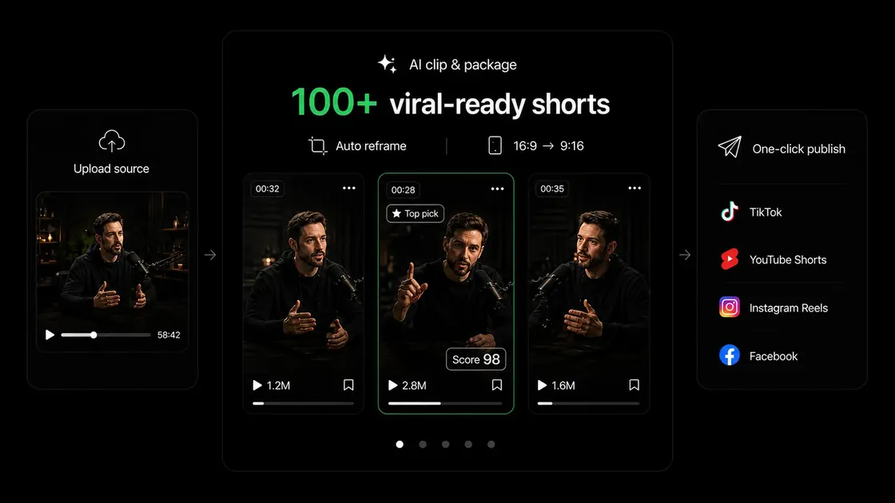

# ShortMind AI

**AI video clipping and content repurposing. Make more of every long video.**

[中文](README.md) · [Official website](https://shortmind.ai) · [Brand homepage](https://shortmindai.github.io/) · [GitHub repository](https://github.com/ShortMindAI/shortmindai.github.io)



## About ShortMind

ShortMind AI is an AI video clipping and content repurposing platform for creators, businesses and marketing teams. It finds shareable moments in long-form videos and connects clip creation, captions, reframing, publishing copy and social distribution in one workflow.

“100+ viral-ready shorts” describes the product’s content repurposing ambition. Useful clip counts depend on the source video’s length, content and settings. Predicted scores do not guarantee views or virality.

## Core capabilities

| Capability | Purpose |
| --- | --- |
| AI highlight detection | Discover candidate clips through dialogue, key ideas and emotional cues. |
| Viral Score | Compare clips using a 0–100 estimate of hook strength, pacing and sharing potential. |
| Automatic hook placement | Bring engaging moments to the opening of a short video. |
| AI captions | Generate dynamic, multilingual subtitles and choose caption styles. |
| AI Reframe | Track faces and subjects for 9:16, 1:1 and 4:5 social formats. |
| B-roll and publishing copy | Add relevant footage and generate titles, descriptions and hashtags. |
| Social publishing | Connect editing with TikTok, YouTube Shorts, Instagram Reels, LinkedIn, Facebook and X publishing workflows. |

Built for podcasts, interviews, courses, livestreams, sports content, marketing teams, media agencies and creator networks, especially teams with a long-form video library. Visit the [official website](https://shortmind.ai) for current features, supported platforms and plans.

## How it works

1. Import your long video on the official website.
2. Review AI-suggested clips and scores; refine captions, hooks and framing.
3. Create short videos and prepare publishing copy and schedules.

## This repository

This repository maintains ShortMind’s static brand introduction website, English and Chinese pages, and documentation. The video processing product is available through the official website.

```text
index.html            English homepage
zh.html               Chinese page
404.html              Custom error page
assets/               Shared CSS, WebP images, icons and social preview
README.md             Chinese documentation
README.en.md          English documentation
robots.txt            Crawler rules and sitemap reference
sitemap.xml           English and Chinese page index
scripts/build_site.py Page generation and image optimization
```

## Preview and maintenance

No Node.js, framework build or client-side JavaScript is required. Start a local server and open `http://localhost:8000`:

```bash
python -m http.server 8000
```

Edit the bilingual content in `scripts/build_site.py` and regenerate the pages. The script requires Python 3.9+ and Pillow (`python -m pip install Pillow`):

```bash
python scripts/build_site.py --pages-only
```

To re-optimize the original PNG files, supply the material directory containing the logo and the `shortmind宣传物料-中英文` subdirectory:

```bash
python scripts/build_site.py --materials "path/to/brand-materials"
```

## GitHub Pages deployment

The account homepage `https://shortmindai.github.io/` requires a repository named `shortmindai.github.io`. Place the files in its root and choose **Settings → Pages → Deploy from a branch → main → / (root)**. Save and wait for deployment. `.nojekyll` enables direct static publishing.

The current Git remote points to `ShortMindAI/shortmindai.github.io`, matching the account homepage URL. For another deployment URL, update `BASE` in the script, `robots.txt`, `sitemap.xml` and the root-relative links in `404.html` to match the live site.

## SEO and performance

- Semantic, directly rendered HTML with headings, navigation and FAQs.
- Distinct titles, descriptions and canonicals with reciprocal language alternates.
- Organization, WebPage and FAQPage JSON-LD, plus Open Graph and Twitter previews. Structured data does not guarantee a particular search appearance.
- Compressed WebP assets, responsive `srcset`, high-priority hero images and lazy-loaded screenshots with explicit dimensions.
- A JPEG social card for preview compatibility; system fonts and no third-party scripts or frontend runtime.

ShortMind — give your best content a second life.
